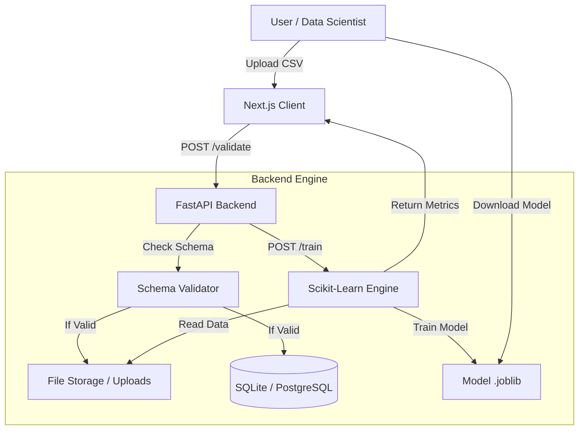

# DATAION ⚡

**The End-to-End Data Platform for Strict Schema Validation & AutoML.**

[](https://opensource.org/licenses/MIT)
[](https://nextjs.org/)
[](https://fastapi.tiangolo.com/)
[](https://tailwindcss.com/)

> **DATAION** bridges the gap between Data Engineering and Machine Learning. It enforces **Data Contracts** to ensure only high-quality, schema-compliant data enters your pipeline, then automatically generates ML models and EDA reports.

<div align="center">
  
</div>

---

## 🚀 Key Features

### 🛡️ Data Contracts & Schema Validation
- **Strict Schema Enforcement:** Define expected columns and data types (`int`, `float`, `string`) before data ingestion.
- **Real-time Validation:** Instantly rejects non-compliant CSV files with detailed error logs.
- **Auto-Schema Inference:** Smartly detects schema from CSV headers and sample data to save setup time.

### 🤖 Automated Machine Learning (AutoML)
- **Instant Training:** Automatically trains a **Random Forest** model on valid datasets.
- **Model Artifacts:** Download trained models (`.joblib`) ready for production deployment.
- **Metrics Dashboard:** View Accuracy, Features Used, and Row counts instantly.

### 📊 Exploratory Data Analysis (EDA)
- **Deep Dive:** Visualize column distributions, missing values, and unique counts without writing code.
- **Data Health Check:** Automatic assessment of dataset readiness for ML.

### 🎨 Modern & Industrial UI
- **Clean Industrial Theme:** Designed for engineers with a focus on readability and utility.
- **Dark/Light Mode:** Fully supported via Tailwind CSS & Next-themes.
- **Interactive Workspace:** Drag-and-drop uploads, dynamic forms, and safe-delete protections.

---

## 🏗 System Architecture

The system follows a decoupled **Client-Server** architecture to ensure scalability.



---

## 🛠 Tech Stack

### Frontend
- **Framework:** Next.js (App Router)
- **Styling:** Tailwind CSS v4 (Industrial Theme)
- **Icons:** Lucide React
- **State Management:** React Hooks
- **HTTP Client:** Axios

### Backend
- **Framework:** FastAPI (Python)
- **Validation:** Pydantic
- **ORM:** SQLAlchemy
- **Database:** SQLite (Dev) / PostgreSQL (Ready)
- **ML Engine:** Pandas, Scikit-learn, Numpy, Joblib

---

## ⚡ Getting Started

Follow these steps to run the project locally.

### 1. Clone Repository
```bash
git clone https://github.com/bestoism/dataion.git
cd dataion
```

### 2. Backend Setup
```bash
cd backend
# Create virtual environment
python -m venv venv

# Activate (Windows)
venv\Scripts\activate
# Activate (Mac/Linux)
source venv/bin/activate

# Install dependencies
pip install -r requirements.txt

# Run Server
uvicorn app.main:app --reload
```
*Backend runs on: `http://127.0.0.1:8000`*

### 3. Frontend Setup
Open a new terminal.
```bash
cd frontend

# Install packages
npm install

# Run Development Server
npm run dev
```
*Frontend runs on: `http://localhost:3000`*

---

## 📸 Screenshots

| **Schema Definition & Contracts** | **AutoML Training Results** |
|:---:|:---:|
|  |  |
| *Managing Data Types & Required Fields* | *Performance Metrics & Download Artifact* |

| **Dataset Explorer (EDA)** | **Elegant Dark Mode** |
|:---:|:---:|
|  |  |
| *Automated Statistics & Distribution* | *Comfortable viewing for night ops* |

---

## 🔮 Future Roadmap

- [ ] Support for S3/GCS Storage.
- [ ] Advanced Model Selection (XGBoost, LightGBM).
- [ ] API Token Authentication (JWT).
- [ ] Deployment via Docker.

---

UNDER CONSTRUCTION
